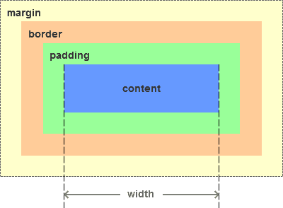
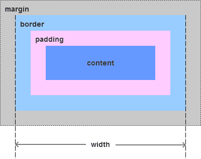

## 盒模型

css 中的盒模型(box model)分为标准盒模型和怪异盒模型，通过 box-sizing 属性来设置：

1. 标准盒模型：box-sizing: content-box
2. 怪异盒模型：box-sizing: border-box

盒模型包含元素内容(content)、内边距(padding)、边框(border)和外边距(margin)。

标准盒模型和怪异盒模型的区别是**元素宽高的计算方式不同**：

1. 标准盒模型中，属性 width/height 表示**元素内容的宽度/高度**
2. 怪异盒模型中，属性 width/height 表示**元素的宽度/高度**，包含**元素内容的宽度/高度以及 padding 和 border**

margin 不参与元素宽度和高度的计算。

### 标准盒模型

标准盒模型下，元素宽度/高度 = content(width/height) + padding + border

### 怪异盒模型

怪异盒模型下，元素宽度/高度(width/height) = content + padding + border

