## Flexbox layout

flexbox 布局教程：https://developer.mozilla.org/zh-CN/docs/Web/CSS/CSS_Flexible_Box_Layout

### flex 容器

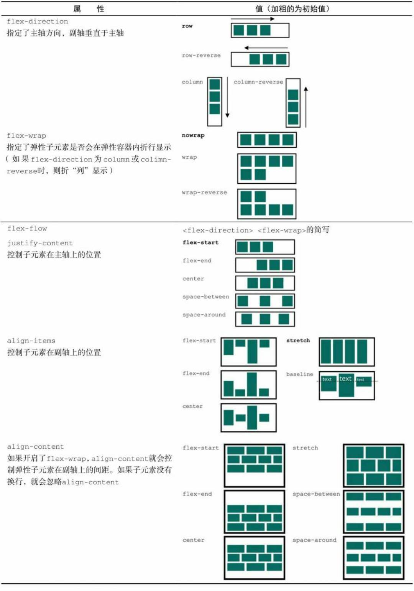

### flex 元素

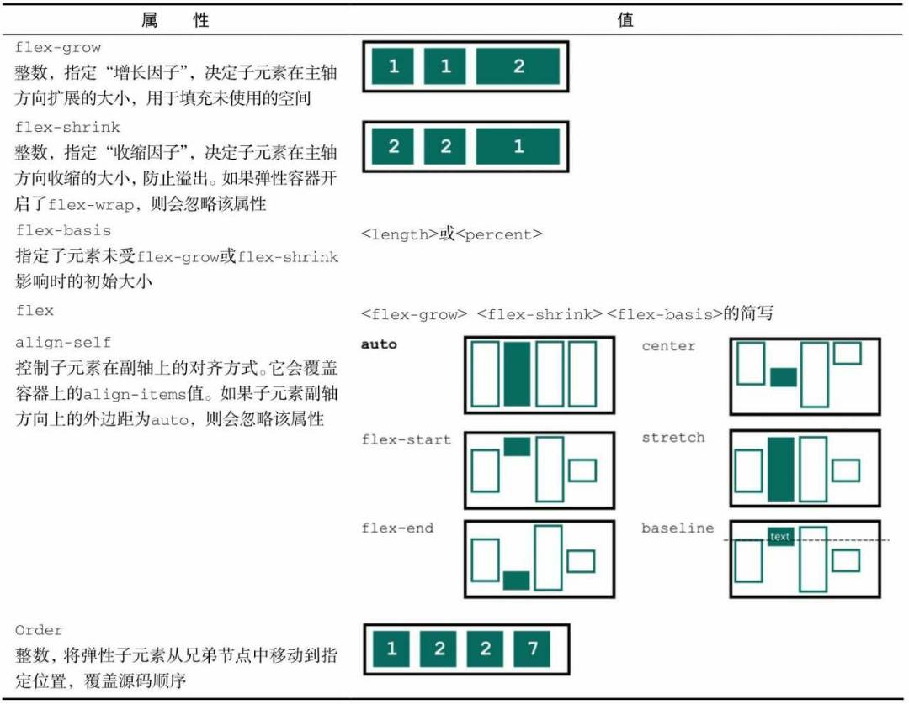

### 最佳实践

flexbox 布局最佳实践：https://developer.mozilla.org/zh-CN/docs/Web/CSS/CSS_Flexible_Box_Layout/Typical_Use_Cases_of_Flexbox

#### 导航

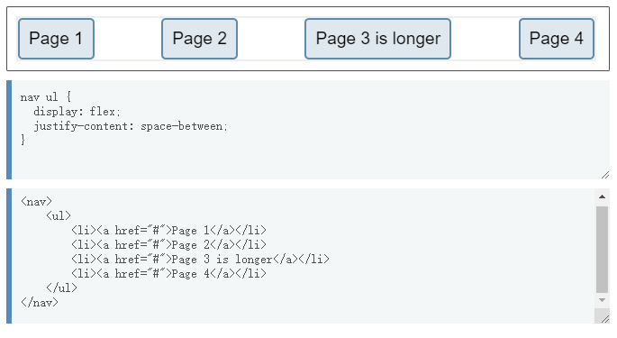

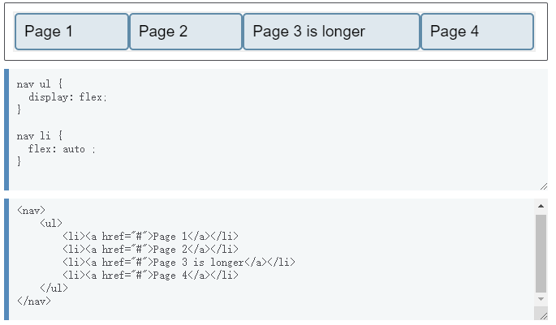

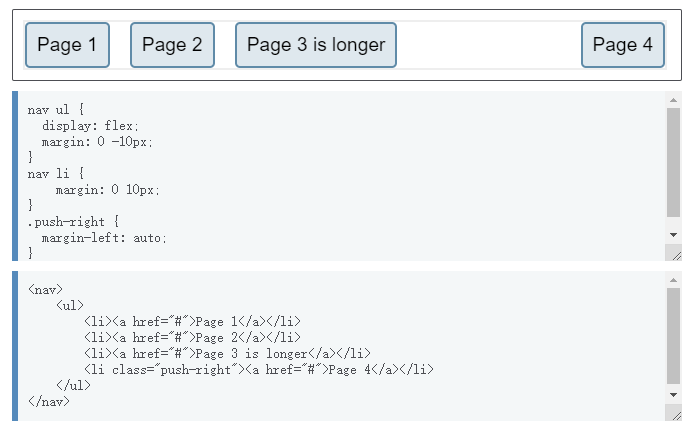

#### 元素居中

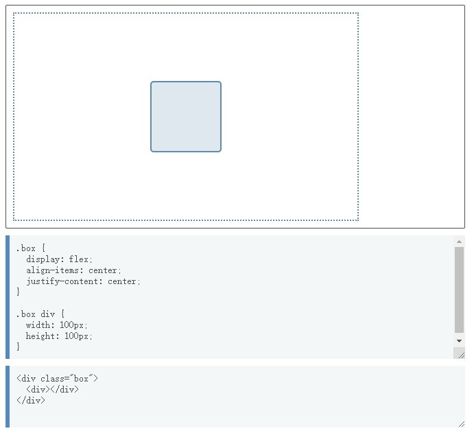

#### 绝对底部

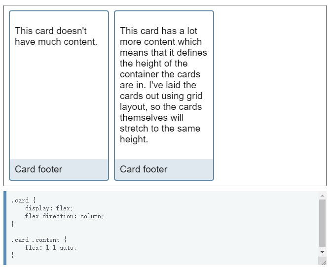

#### 媒体对象

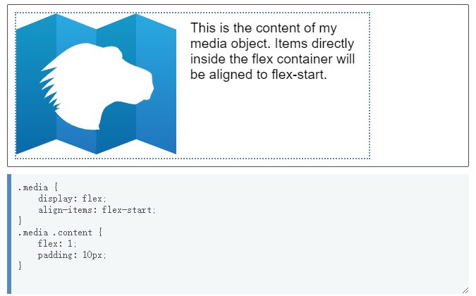

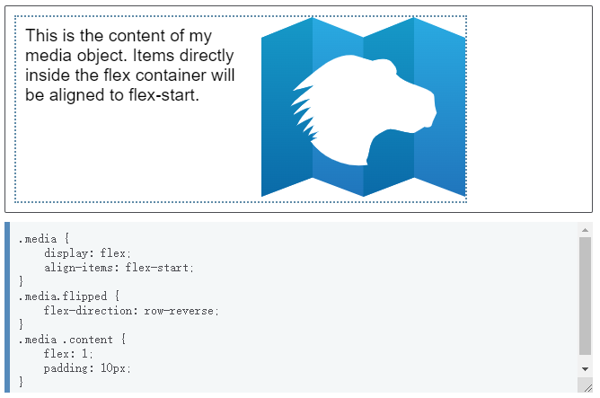

#### 表单控制

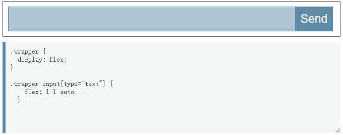

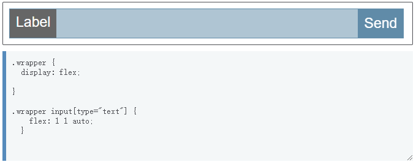
