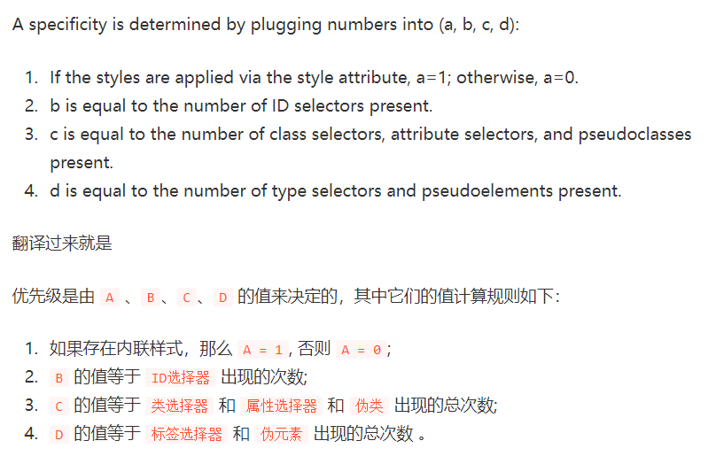

## 优先级和计算规则

### 样式引入

css 样式引入的方式有三种：

1. 行内样式(inline style sheet)
2. 内部样式(internal style sheet)
3. 外部样式(external style sheet)

优先级：行内样式 > 内部样式 | 外部样式，内部样式的优先级并不大于外部样式，内部样式和外部样式的优先级取决于**加载顺序**。

```html
<!-- <link rel="stylesheet" href="lightgreen.css"> -->
<style>
  .bg {
    background-color: lightpink;
  }
</style>
<link rel="stylesheet" href="lightgreen.css">
<div class="box bg"></div><!-- 外部样式 > 内部样式，显示绿色 -->
```

```html
<link rel="stylesheet" href="lightgreen.css">
<style>
  .bg {
    background-color: lightpink;
  }
</style>
<!-- <link rel="stylesheet" href="lightgreen.css"> -->
<div class="box bg"></div><!-- 内部样式 > 外部样式，显示粉色 -->
```

```html
<link rel="stylesheet" href="lightgreen.css">
<style>
  .bg {
    background-color: lightpink;
  }
</style>
<!-- 行内样式 > 内部样式 | 外部样式，显示蓝色 -->
<div class='box bg' style="background-color: lightblue;"></div>
```

完整代码 [inline-internal-external.html](css-selector-priority.assets/inline-internal-external.html)

### 计算规则

选择器的优先级官方称为特异性值(specificity)，[特异性值的计算规则](https://juejin.cn/post/6844903709772611592)：



注意：通用选择器(*)和组合器(>、+、~)不参与特异性值的计算。

```css
#nav-global > ul > li > a.nav-link

/*
  套用上面的算法，依次求出 A B C D 的值：

  1.因为没有内联样式，所以 A = 0
  2.id 选择器总共出现了 1 次，B = 1
  3.类选择器出现了 1 次，属性选择器出现了 0 次，伪类选择器出现 0 次，所以 C = (1 + 0 + 0) = 1
  4.元素选择器出现了3 次，伪元素出现了 0 次，所以 D = (3 + 0) = 3

  上面算出的 A、B、C、D 可以简记作：(0, 1, 1, 3)
*/
```

#### !important

由特异性值的计算规则可以得知行内样式的优先级最高，如果想要覆盖行内样式，可以在内部或外部样式表中使用 !important 关键字。

```html
<style>
  .bg {
    background-color: lightpink !important;
  }
</style>
<!-- 因为 !important，内部样式 > 行内样式，显示粉色 -->
<div class='box bg' style="background-color: lightblue;"></div>
```

### 层叠顺序

[当多条规则应用于同一个元素时](https://www.cnblogs.com/wangmeijian/p/4207433.html)：

1. 首先查看规则是否加了权重(!important 关键字)，加了权重的优先级最高
2. 权重相同的情况下，比较规则的特异性值，特异性值大的优先级更高
3. 特异性值相同的下，后面的规则覆盖前面的规则(按照加载顺序)


