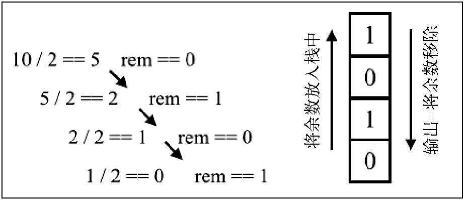

### [栈](Stack.js)的应用场景

#### 进制转换



```js
// 十进制转二进制
function decimalToBinary(decimal) {

  // 使用栈存储每次的余数
  let stack = []

  while (decimal) {
    stack.push(decimal % 2)
    decimal >>= 1 // 右移一位模拟整除2
  }

  let result = ''
  while (stack.length) {
    // 按照出栈的顺序拼接字符
    result += stack.pop()
  }

  return result
}

decimalToBinary(10) // "1010"
decimalToBinary(1024) // "10000000000"
```

```js
// 十进制转任意进制
function baseConverter(decimal, base) {

  if (base < 2 || base > 36)
    throw new Error('base is out of range')

  // 使用栈存储每次的余数
  let stack = []

  let digits = '0123456789ABCDEFGHIJKLMNOPQRSTUVWXYZ'

  while (decimal) {
    stack.push(decimal % base)
    decimal = Math.floor(decimal / base)
  }

  let result = ''
  while (stack.length) {
    result += digits[stack.pop()]
  }

  return result
}

baseConverter(10, 2) // "1010"
baseConverter(15, 16) // "F"
```

#### 括号匹配问题

> 给定一个只包括 '('，')'，'{'，'}'，'['，']' 的字符串，判断字符串是否有效。
>
> 有效字符串需满足：左括号必须与相同类型的右括号匹配，左括号必须以正确的顺序匹配。例如，{ [ ( ) ( ) ] } 是合法的，而 { ( [ ) ] } 是非法的。


```js
function bracketMatch(brackets) {

  let stack = []

  for (let bracket of brackets) {

    if (/\(|\[|\{/.test(bracket)) { // 左括号入栈
      let left = bracket
      stack.push(left)
    } else if (/\)|\]|\}/.test(bracket)) { // 右括号不入栈
      let right = bracket
      let pair = stack.pop() + right // 出栈一个左括号配对

      // 如果配对的括号匹配继续遍历，否则停止遍历
      if (/\(\)|\[\]|\{\}/.test(pair))
        continue
      else
        break
    }
  }

  // 栈为空就表示括号全部配对，否则就不合法
  return !stack.length ? 'legal' : 'illegal'
}

bracketMatch('{ [ ( ) ( ) ] }') // "legal"
bracketMatch('{ ( [ ) ] }') // "illegal"
```

#### 网页的前进、后退功能


```js
const webpage = {

  forwardStack: [],
  backStack: [],

  click: function (pageNum) {
    this.backStack.push(pageNum)
    return pageNum
  },

  back: function () {
    let page = this.backStack.pop()
    this.forwardStack.push(page)
    return this.backStack[this.backStack.length - 1]
  },

  forward: function () {
    let page = this.forwardStack.pop()
    this.backStack.push(page)
    return page
  }
}

webpage.click(1)
webpage.click(2)
webpage.click(3)
```

