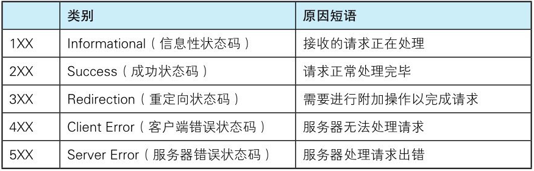

## HTTP/1

参考链接：[29 | HTTP/1：HTTP性能优化](https://time.geekbang.org/column/article/147501)

### HTTP/0.9

HTTP/0.9 特性：

1. 请求报文只有请求行，没有请求头和请求体
2. 响应报文也没有请求头，直接返回 HTML 文件
3. 采用 ASCII 字节码传输 HTML 文件

### HTTP/1.0

HTTP/1.0 新特性：

1. 引入请求头和响应头，以 Key-Value 形式保存
2. 状态码(Status Code)
3. 缓存机制(Cache)
4. 用户代理(User-Agent)

#### 内容协商(Content Negotiation)

内容协商机制是指客户端和服务器端就响应的资源内容进行交涉，然后提供给客户端最为适合的资源。

内容协商会以响应资源的语言、字符集、编码方式等作为判断的基准。

```js
// 请求头
Accept: text/html // 期望服务器返回的文件类型
Accept-Encoding: gzip, deflate, br // 期望返回的压缩方式(这里的编码指的是压缩)
Accept-Charset: ISO-8859-1, utf-8 // 期望返回的文件编码(字符编码)
Accept-Language: zh-CN, zh // 期望返回的页面语言

// 响应头
// 服务器返回的不一定是浏览器期望的值，以服务器返回的值为准进行解析
Content-Encoding: br // 服务器返回的压缩方式
Content-Type: text/html; charset=UTF-8 // 服务器返回的文件类型
```

参考链接：《图解 HTTP》3.6 内容协商返回最合适的内容

#### 状态码(Status Code)



常见的 HTTP 状态码：

- 200 OK，表示请求被正常处理了
- 301 Moved Permanently，永久重定向，表示请求的资源已被分配了新的 URI，以后应使用资源现在所指的 URI，新的 URI 保存在响应头 Location 中
- 302 Found，临时重定向，表示请求的资源已被分配了新的 URI，希望用户(本次)能使用新的 URI 访问，和 301 的区别是不会缓存新的 URI
- 303 See Other，临时重定向，POST 请求重定向为 GET 请求，比如上传用户信息后跳转到上传成功页面
- 304 Not Modified，表示服务器端资源未改变，可直接使用客户端未过期的缓存，返回的响应报文中不包含主体
- 307 Temporary Redirect，临时重定向，POST 请求不能重定向为 GET 请求(会丢失 POST 主体中的参数)，必须重定向为 POST 请求
- 308 Permanent Redirect，永久重定向，POST 请求不能重定向为 GET 请求(会丢失 POST 主体中的参数)，必须重定向为 POST 请求
- 400 Bad Request，表示请求报文中存在语法错误
- 401 Unauthorized，表示发送的请求需要通过 HTTP 认证
- 403 Forbidden，表示请求被服务器拒绝了，通常是访问权限出现问题
- 404 Not Found，表示服务器上无法找到请求的资源
- 500 Internal Server Error，服务器内部错误，表示服务器在执行请求时发生了错误
- 503 Service Unavailable，服务暂时不可用，表示服务器暂时处于超负载或正在进行停机维护，现在无法处理请求

参考链接：

- 《图解 HTTP》第4章 返回结果的 HTTP 状态码
- [http 状态码301、302、303、307、308 的区别](https://juejin.cn/post/6844904129760870414)
- [HTTP 中的 301、302、303、307、308 响应状态码](https://zhuanlan.zhihu.com/p/60669395)

#### 缓存机制(Cache)

参考链接：

- [彻底弄懂HTTP缓存机制及原理](https://www.cnblogs.com/chenqf/p/6386163.html)
- [一文读懂http缓存（超详细）](https://www.jianshu.com/p/227cee9c8d15)

### HTTP/1.1

HTTP/1.1 新特性：

1. 持久连接(Persistent Connections)
2. 管线化(Pipelining)
3. 分块传输(Chunk Transfer)
4. 客户端状态管理(Cookie)
5. 支持虚拟主机(Virtual Host)

#### 持久连接(Persistent Connections)

HTTP/1.0 每发送一个 HTTP 请求都要建立一次 TCP 连接，HTTP/1.1 中增加了持久连接的方法，它的特点是在一个 TCP 连接上可以传输多个 HTTP 请求，只要浏览器或者服务器没有明确断开连接，那么该 TCP 连接会一直保持。

持久连接在 HTTP/1.1 中是默认开启的，不需要专门为了持久连接设置 HTTP 请求头，如果不想用持久连接，可以在 HTTP 请求头中加上 Connection: close。目前浏览器中对于同一个域名，默认允许同时建立 6 个 TCP 持久连接。(持久连接也叫长连接，非持久连接叫作短连接)

```js
// 响应头
// HTTP/1.1 默认开启持久连接，服务端想断开的话设置 close
Connection: close

// 请求头
// HTTP/1.1 之前的版本默认都是非持久连接，开启持久连接需要设置 Keep-Alive
Connection: Keep-Alive

// 响应头
Connection: Keep-Alive
Keep-Alive: timeout=10, max=500
```

参考链接：

- 《图解 HTTP》2.7 持久连接节省通信量
- 《图解 HTTP》6.3.2 Connection
- [HTTP长连接和短连接](https://www.cnblogs.com/0201zcr/p/4694945.html)

#### 管线化(Pipelining)

持久连接虽然能减少 TCP 的建立和断开次数，但是它需要等待前面的请求返回之后，才能进行下一次请求。如果 TCP 通道中的某个请求因为某些原因没有及时返回，那么就会阻塞后面的所有请求，这就是著名的**队头阻塞**的问题。

HTTP/1.1 中试图通过管线化的技术来解决队头阻塞的问题。HTTP/1.1 中的管线化是指并行发送多个 HTTP 请求，虽然可以并行发送多个请求，但是服务器依然需要根据请求到达的顺序来响应浏览器的请求。

FireFox、Chrome 都做过管线化的试验，但是由于各种原因，它们最终都放弃了管线化技术。

参考链接：

- 《图解 HTTP》2.7 持久连接节省通信量
- 《HTTP/2 in Action》2.1.2 HTTP/1.1 管道化
- [HTTP详解长短连接，管道化，队头阻塞及它们之间的关系](https://blog.csdn.net/fesfsefgs/article/details/108294050)

#### 分块传输(Chunk Transfer)

在设计 HTTP/1.0 时，需要在响应头中设置完整的数据大小，如 Content-Length: 901，这样浏览器就可以根据设置的数据大小来接收数据。不过随着服务器端的技术发展，很多页面的内容都是动态生成的，因此在传输数据之前并不知道最终的数据大小，这就导致了浏览器不知道何时会接收完所有的文件数据。

HTTP/1.1 通过引入分块传输机制来解决这个问题，服务器会将数据分割成若干个任意大小的数据块，每个数据块发送时会附上数据块的长度，最后使用一个零长度的块作为发送数据完成的标志。这样就提供了对动态内容的支持。

```js
// 响应头
Transfer-Encoding: chunked

// 注意区分 Content-Encoding
// Transfer-Encoding 是传输编码，Content-Encoding 是对响应主体里的内容进行压缩编码
Content-Encoding: gzip, compress, deflate, identity
```

参考链接：

- 《图解 HTTP》6.3.6 Transfer-Encoding
- [网络协议进阶之 chunked 编码](https://juejin.cn/post/6844904052828930055)

#### 客户端状态管理(Cookie)

HTTP 是一种无状态协议，即自身不对请求和响应之间的通信状态进行保存，对于发送过的请求或响应都不做持久化处理。无状态带来了一些问题，比如用户登录到一家购物网站，即使他跳转到该站的其他页面后，也需要能继续保持登录状态。针对这个实例，网站为了能够掌握是谁送出的请求，需要保存用户的状态。

HTTP/1.1 引入 Cookie 用来实现保持状态的功能，Cookie 技术通过在请求和响应报文中写入 Cookie 信息来控制客户端的状态。

服务器发送的响应头中设置 Set-Cookie 字段，通知客户端保存 Cookie。当下次客户端再往该服务器发送请求时，客户端会自动在请求头中加入 Cookie 值后发送出去。服务器发现客户端发送过来的 Cookie 后，会去检查究竟是从哪一个客户端发来的连接请求，然后对比服务器上的记录，最后得到之前的状态信息。

```js
// 响应头
Set-Cookie: BDORZ=27315; max-age=86400; domain=.baidu.com; path=/

// Cookie 是不安全的，避免被 js 获取可以设置 HttpOnly 属性
Set-Cookie: uid=141242; HttpOnly
// 也可以设置 Secure，表示只在 HTTPS 安全连接上发送 Cookie
Set-Cookie: uid=141242; secure

// 请求头
Cookie: uid=141242
```

参考链接：

- 《图解 HTTP》2.3 HTTP是不保存状态的协议
- 《图解 HTTP》2.8 使用Cookie的状态管理
- 《图解 HTTP》6.7 为Cookie服务的首部字段

#### 支持虚拟主机(Virtual Host)

在 HTTP/1.0 中，每个域名绑定了一个唯一的 IP 地址，因此一个服务器只能支持一个域名。但是随着虚拟主机技术的发展，需要实现在一台物理主机上绑定多个虚拟主机，每个虚拟主机都有自己的单独的域名，这些单独的域名都公用同一个 IP 地址。

HTTP/1.1 的请求头中新增 Host 字段，用来表示当前的域名地址，这样服务器就可以根据不同的 Host 值做不同的处理。

```http
GET /index.html HTTP/1.1
Host: www.baidu.com
```

参考链接：

- 《图解 HTTP》5.1 用单台虚拟主机实现多个域名

## HTTP/2

参考链接：[30｜HTTP/2：如何提升网络速度？](https://time.geekbang.org/column/article/148546)

HTTP/2 新特性：

1. 多路复用(Multiplexing)
2. 设置请求的优先级
3. 服务器推送
4. 头部压缩

## HTTP/3

参考链接：[31｜HTTP/3：甩掉TCP、TLS 的包袱，构建高效网络](https://time.geekbang.org/column/article/150159)

HTTP/3 新特性：

1. 解决 TCP 队头阻塞问题
