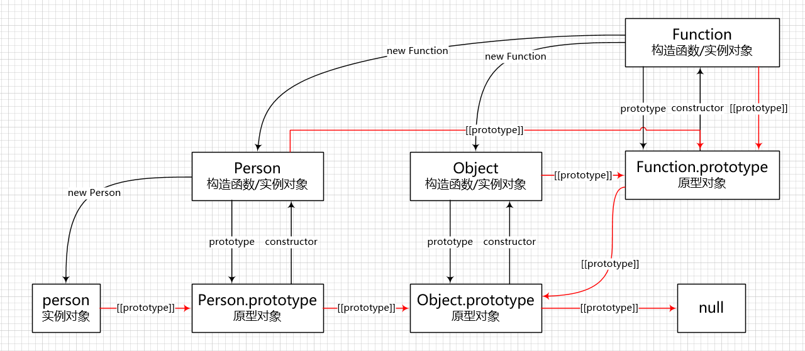

## 原型

js 中一切皆对象，每个实例对象都拥有一个原型对象，可以从原型对象中继承属性和方法。

js 中函数也是对象，函数是一种特殊的对象，特殊在函数是一种可调用的对象。作为对象，函数也拥有属性和方法。

```js
function func() {}

func instanceof Object // true
typeof func.prototype // "object"
typeof func.call // "function"
```

大部分函数都有一个 prototype 属性，当函数作为构造函数被调用时，函数的 prototype 属性会作为实例对象的原型进行构造，从而使得实例对象继承原型上的属性和方法。

原型作为对象，也拥有自己的原型，这样就形成了一条原型链，对象查找属性时会一直沿着原型链向上查找，原型链的顶端指向 null。原型对象不光有自己的原型对象，还有一个 constructor 属性，指回实例对象的构造函数。

```js
function Person() {}
Person.prototype.name = 'people'
Person.prototype.say = function () { return this.name }

let p = new Person
p.name // "people"
p.say() // "people"

Person.prototype.constructor === Person // true
Object.getPrototypeOf(p).constructor === Person // true
```

虽然实例对象的原型和构造函数的 prototype 属性指向同一个对象，但二者在概念上还是有所区分。

原型对象是针对实例对象而言的，函数作为实例对象也拥有自己的原型对象，函数的原型对象是其构造函数 Function 的 prototype 属性，而不是自身的 prototype 属性，注意要区分函数的原型对象和函数的 prototype 属性。

```js
function func() {}

// 函数作为实例对象
Object.getPrototypeOf(func) === Function.prototype // true

// 函数作为构造函数
Object.getPrototypeOf(new func) === func.prototype // true
```

构造函数、实例对象和原型对象之间的关系：



## 继承

js 是基于**原型**继承的，即使 es6 新增了 class 关键字，本质上还是基于原型来实现继承。

js 中继承的几种方式：

1. 原型链继承
2. 构造函数继承
3. *组合继承
4. 原型式继承
5. 寄生式继承
6. *寄生组合继承
7. *es6 的 extends

### 原型链继承

原型链继承是通过将父类的实例对象设置为子类的原型对象，从而使得子类继承父类的属性，但对于引用类型的属性无法私有化。

```js
function Parent() {
  this.name = 'parent'
  this.play = [1, 2, 3]
}

function Child() {
  this.type = 'child'
}

Child.prototype = new Parent() // 将父类的实例对象设置为子类的原型对象，通过原型链继承父类的所有属性

let child1 = new Child()
let child2 = new Child()
child1.play.push('a')
child1.play // [1, 2, 3, 'a']
child2.play // [1, 2, 3, 'a']
// 缺陷：子类的多个实例对象共享同一个原型对象，当某一个实例对象修改了原型对象，会影响其它的实例对象
```

### 构造函数继承

构造函数继承是在子类的构造函数中调用父类的构造函数，从而继承父类的实例属性，但无法继承父类原型上的属性。

```js
function Parent() {
  this.name = 'parent'
  this.play = [1, 2, 3]
}

Parent.prototype.getName = function () {
  return this.name
}

function Child() {
  Parent.call(this) // 在子类构造函数中通过 call() 调用父类构造函数，继承父类的实例属性
  this.type = 'child'
}

let child1 = new Child()
let child2 = new Child()
child1.play.push('a')
child1.play // [1, 2, 3, 'a']
child2.play // [1, 2, 3]

child1.getName // undefined
child2.getName // undefined
// 缺陷：只能继承父类的实例属性，无法继承父类原型上的属性
```

### *组合继承

组合继承是结合了原型链继承和构造函数继承两者的优点发展而来，缺陷是父类构造函数被继承了两次，增加了不必要的内存开销。

```js
function Parent() {
  this.name = 'parent'
  this.play = [1, 2, 3]
}

Parent.prototype.getName = function () {
  return this.name
}

function Child() {
  Parent.call(this) // 在子类构造函数中通过 call() 调用父类构造函数，继承父类的实例属性
  this.type = 'child'
}

Child.prototype = new Parent() // 将父类的实例对象设置为子类的原型对象，通过原型链继承父类的所有属性
Child.prototype.constructor = Child // 因为修改了构造函数 Child 的原型对象，需要设置 constructor 属性指向自身

let child1 = new Child()
let child2 = new Child()
child1.play.push('a')
child1.play // [1, 2, 3, 'a']
child2.play // [1, 2, 3]

child1.getName() // 'parent'
child2.getName() // 'parent'
// 缺陷：调用了两次父类构造函数：Parent.call()、new Parent()，父类的实例属性被继承了两次，增加了不必要的内存开销
```

### 原型式继承

原型式继承是通过将一个实例对象作为原型直接创建一个新的对象，和原型链继承的缺陷一样，对于引用类型的属性无法私有化。

```js
let parent = {
  name: 'parent',
  play: [1, 2, 3],
  getName() {
    return this.name
  }
}

// 使用临时构造函数
function createObject(proto) {
  function F() {}
  F.prototype = proto
  return new F()
}

// 使用 Object.create()
let person1 = Object.create(parent)
person1.name = 'ace'

let person2 = Object.create(parent)
person2.play.push('luffy')

person1.name // 'ace'
person2.name // 'parent'
person1.play // [ 1, 2, 3, "luffy" ]
person2.play // [ 1, 2, 3, "luffy" ]
// 缺陷：和原型链继承一样，多个实例对象指向同一个原型对象，存在篡改原型对象的可能
```

### 寄生式继承

寄生式继承是在原型式继承的基础上创建一个封装继承过程的函数，函数内部再添加一些方法用来增强对象，缺陷和原型式继承一样。

```js
let parent = {
  name: 'parent',
  play: [1, 2, 3],
  getName() {
    return this.name
  }
}

function create(proto) {
  let clone = Object.create(proto)
  clone.getFriend = function () {
    return this.play
  }
  return clone
}

let person1 = create(parent)
person1.name = 'ace'

let person2 = create(parent)
person2.play.push('luffy')

person1.name // 'ace'
person2.name // 'parent'
person1.getFriend() // [ 1, 2, 3, "luffy" ]
person2.getFriend() // [ 1, 2, 3, "luffy" ]
// 缺陷：和原型式继承一样，多个实例对象指向同一个原型对象，存在篡改原型对象的可能
```

### *寄生组合继承

寄生组合继承是结合寄生式继承和组合继承，解决了组合继承调用两次构造函数的缺陷，是目前所有继承方式里相对最优的继承方式。

```js
function Parent() {
  this.name = 'parent'
  this.play = [1, 2, 3]
}

Parent.prototype.getName = function () {
  return this.name
}

function Child() {
  Parent.call(this) // 在子类构造函数中通过 call() 调用父类构造函数，继承父类的实例属性
  this.type = 'child'
}

// Child.prototype = new Parent() // 将父类的实例对象设置为子类的原型对象，通过原型链继承父类的所有属性
Child.prototype = Object.create(Parent.prototype) // 将父类的原型对象作为原型创建一个空对象，避免再次继承父类的实例属性
Child.prototype.constructor = Child // 因为修改了构造函数 Child 的原型对象，需要设置 constructor 属性指向自身

Child.prototype.getFriend = function () {
  return this.play
}

let child1 = new Child()
let child2 = new Child()
child1.play.push('a')
child1.play // [1, 2, 3, 'a']
child2.play // [1, 2, 3]

child1.getName() // 'parent'
child2.getName() // 'parent'
// 优点：只调用了一次父类构造函数：Parent.call()，避免了父类的实例属性被继承两次，减少不必要的内存开销
```

### *extends 继承

es6 新增了 class、extends 关键字，用来模拟类的继承，本质上还是语法糖，底层实现使用的还是寄生组合继承。

```js
class Parent {
  constructor() {
    this.name = 'parent'
    this.play = [1, 2, 3]
  }
  
  // 原型方法，即 Parent.prototype.getName
  getName() {
    return this.name
  }
}

class Child extends Parent {
  constructor() {
    super() // 相当于 Parent.call(this)
    this.type = 'child'
  }

  // 原型方法，即 Child.prototype.getFriend
  getFriend() {
    return this.play
  }
}

let child1 = new Child()
let child2 = new Child()
child1.play.push('a')
child1.play // [1, 2, 3, 'a']
child2.play // [1, 2, 3]

child1.getName() // 'parent'
child2.getName() // 'parent'
```

使用 babel 将 es6 编译成 es5，查看 extends 的底层实现使用的是寄生组合继承。

```js
function _inherits(subClass, superClass) {
  if (typeof superClass !== "function" && superClass !== null) {
    throw new TypeError("Super expression must either be null or a function");
  }

  subClass.prototype = Object.create(
    superClass && superClass.prototype,
    {
      constructor: {
        value: subClass,
        writable: true,
        configurable: true
      }
    });

  if (superClass) _setPrototypeOf(subClass, superClass);
}

function _setPrototypeOf(o, p) {

  _setPrototypeOf = Object.setPrototypeOf ||
    function _setPrototypeOf(o, p) {
      o.__proto__ = p;
      return o;
    };

  return _setPrototypeOf(o, p);
}
```

