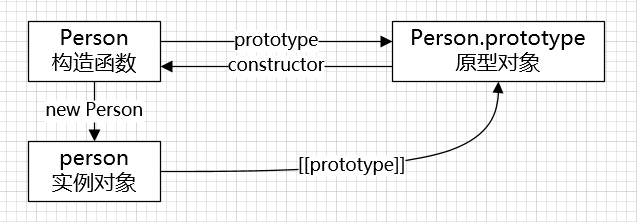
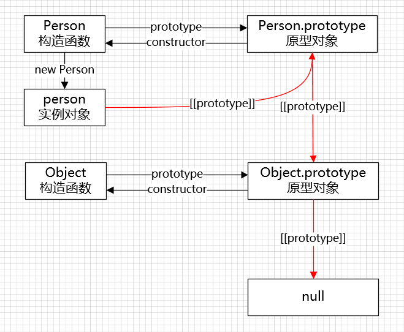
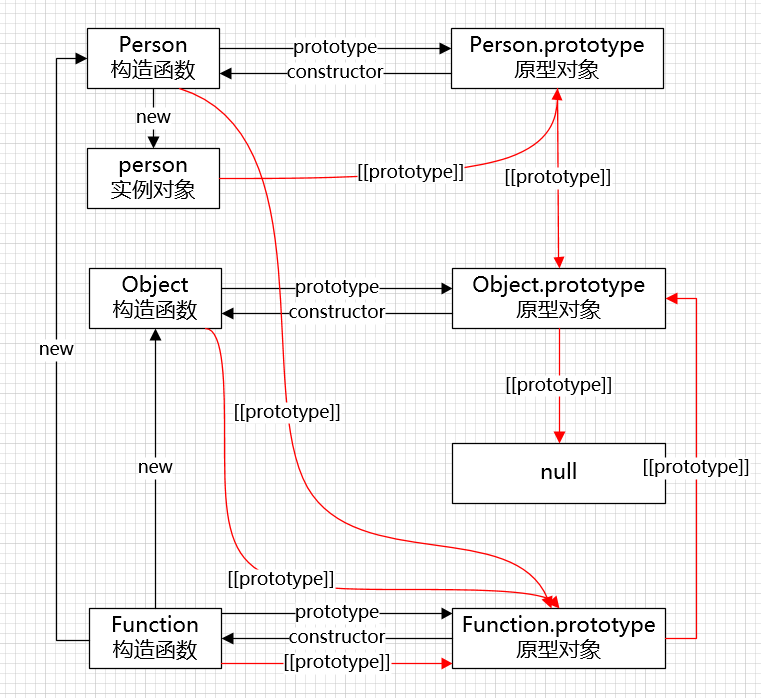

## 原型

### 构造函数和实例

js 中通常使用 new 构造函数的形式来创建实例对象：

```js
function Person(name) {
  this.name = name
}

let person = new Person('ace')
person // { name: "ace" }
```

在 js 中函数也是一种特殊的对象，特殊在函数是一种可调用的对象，函数作为对象是构造函数 Function 的实例。

```js
function Person(name) {
  this.name = name
}

// 构造函数 Person 也是对象
Person instanceof Object // true
// 构造函数 Person 作为对象，是构造函数 Function 的实例
Person instanceof Function // true
```

### prototype

函数既然是对象那就也具有属性，大部分函数都有一个 prototype 属性，这个 prototype 属性实际指向一个对象。

```js
function Person(name) {
  this.name = name
}

// name 是 Person 的实例属性
'name' in Perosn // true
Person.hasOwnProperty('name') // true

// prototype 也是 Person 的实例属性
'prototype' in Person // true
Person.hasOwnProperty('prototype') // true

// call 不是 Person 自身上的属性
'call' in Person // true
Person.hasOwnProperty('call') // false

// apply 不是 Person 自身上的属性
'apply' in Person // true
Person.hasOwnProperty('apply') // false

typeof Person // "function"
typeof Person.prototype // "object"
```

并不是所有的函数都具有 prototype 属性，比如常见的 call 方法，以及 bind 方法返回的函数都没有 prototype 属性：                                                                                                                                                                                                                                                                                                                                                                                                                                                                                                                                                                                                                                                                                                                                                                                                                                                                                                                                

```js
function Person(name) {
  this.name = name
}
typeof Person.call // "function"
'prototype' in Person.call // false

let PersonBound = Person.bind({})
typeof PersonBound // "function"
'prototype' in PersonBound // false
```

当函数作为**构造函数**被调用时，函数的 prototype 属性会作为实例对象的原型进行构造，从而使得实例对象继承原型对象上的属性和方法。

```js
function Person(name) {
  this.name = name
}
Person.prototype.job = 'front-end'
Person.prototype.say = function () { return this.name }

let person = new Person('ace')

person.name // "ace"
person.hasOwnProperty('name') // true

person.job // "front-end"
person.hasOwnProperty('job') // false

person.say() // "ace"
person.hasOwnProperty('say') // false
```

### constructor

构造函数的 prototype 属性指向原型对象，而原型对象也具有一个 constructor 属性指回构造函数。

```js
function Person(name) {
  this.name = name
}

Person.prototype.constructor === Person // true
```

因为实例对象会继承原型对象上的属性和方法，所以实例对象也能够访问 constructor 属性找到它的构造函数。

```js
function Person(name) {
  this.name = name
}

let person = new Person('ace')
person.constructor === Person // true
```

### [[prototype]]

实例对象可以直接访问原型对象上的属性和方法，在 chrome 之前的版本中，实例对象甚至可以通过 `__proto__` 属性直接访问原型对象。

但 `__proto__` 属性并不是标准中所规定的，在最近的 chrome 版本中已经将该属性改为了一个内部的私有属性，不允许直接访问。

标准中提供 Object.getPrototypeOf() 和 Object.setPrototypeOf() 两个方法允许实例对象访问和修改原型对象。

```js
function Person(name) {
  this.name = name
}

let person = new Person('ace')

// 不推荐
person.__proto__ === Person.prototype // true

// 推荐
Object.getPrototypeOf(person) === Person.prototype // true
```

构造函数、实例对象和原型对象三者之间的关系，如下图所示：



### 原型链

实例对象在被创建时都会拥有一个原型对象，而原型对象作为对象也拥有自己的原型，这样原型指向原型就形成了一条原型链，原型链的顶端指向 null。

```js
function Person(name) {
  this.name = name
}

let person = new Person('ace')

// 实例对象 person 的原型指向 Person.prototype
Object.getPrototypeOf(person) === Person.prototype // true

// 原型对象 Person.prototype 的原型指向 Object.prototype
Object.getPrototypeOf(Person.prototype) === Object.prototype // true

// 原型对象 Object.prototype 的原型指向 null
Object.getPrototypeOf(Object.prototype) === null // true
```

原型链之间的关系，如下图所示：



虽然实例对象的原型和构造函数的 prototype 属性指向同一个对象，但二者在概念上还是有所区分。

原型对象是针对实例对象而言的，函数作为实例对象也拥有自己的原型对象，函数的原型对象是其构造函数 Function 的 prototype 属性，而不是自身的 prototype 属性，注意要区分函数的原型对象和函数的 prototype 属性。

```js
function Person() {}

// 函数作为实例对象
Object.getPrototypeOf(Person) === Function.prototype // true
Object.getPrototypeOf(Object) === Function.prototype // true

// 函数作为构造函数
Object.getPrototypeOf(new Person) === Person.prototype // true
Object.getPrototypeOf(new Object) === Object.prototype // true
```

原型链之间的关系，如下图所示（图中一共有4条原型链）：



> 面试题：判断下面代码的输出结果。

```js
function Person() {}

Person.__proto__ === Function.prototype // true
Object.__proto__ === Function.prototype // true
Function.__proto__ === Function.prototype // true
```

