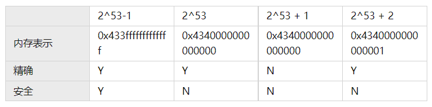

## 浮点数精度问题（0.1 + 0.2 !== 0.3）

### 进制转换

十进制转二进制可以使用 toString(radix) 方法：

```js
(57).toString(2) // '111001'
```

二进制转十进制可以使用 parseInt(string, radix) 方法：

```js
parseInt('111001', 2) // 57
```

js 中的浮点数在底层是以二进制存储的，浮点数转为二进制的过程中存在精度丢失：

```js
.1.toString(2) // 0.1 转为二进制是 0.0 0011 0011 ...
// '0.0001100110011001100110011001100110011001100110011001101'

.2.toString(2) // 0.2 转为二进制是 0.0011 0011 ...
// '0.001100110011001100110011001100110011001100110011001101'
```

### 进制转换算法

十进制整数转二进制：除2取余，从下往上

```js
57 / 2 = 28...1
28 / 2 = 14...0
14 / 2 =  7...0
 7 / 2 =  3...1
 3 / 2 =  1...1
 1 / 2 =  0...1
// 十进制 57 等于 二进制 111001
```

十进制小数转二进制：乘2取整，从上往下

```js
0.125 * 2 = 0.25...0
0.25 * 2 = 0.5...0
0.5 * 2 = 1...1
// 十进制 0.125 等于 二进制 0.001 
```

```js
0.1 * 2 = 0.2...0
0.2 * 2 = 0.4...0
0.4 * 2 = 0.8...0
0.8 * 2 = 1.6...1
0.6 * 2 = 1.2...1
0.2 * 2 = 0.4...0
0.4 * 2 = 0.8...0
0.8 * 2 = 1.6...1
0.6 * 2 = 1.2...1
// 重复 0011
// 十进制 0.1 等于 二进制 0.0 0011 0011 ...
```

只有以 5 结尾的十进制小数才能转为**有限的**二进制小数，其它的小数都会转为**无限的**二进制小数，超出计算机所能保存的最大长度后，就会截取丢失精度。

.1 + .2 中存在三次进制转换，.1 转二进制丢失精度，.2 转二进制丢失精度，两个二进制之和转十进制丢失精度，所以造成 .1 + .2 !== .3。

### 浮点数存储（IEEE754）

js 中数值采用的是 IEEE754 标准规定的 64 位双精度浮点数进行存储的：

```js
// 64bit = 8Byte
// 1位符号位 11位指数位 52位尾数位
// 符号位控制数的正负
// 指数位控制数的大小，表示最大数、最小数
// 尾数位控制数的精度
```

> V = (-1)^Sign * (1 + Fraction) * 2^Exponent
>
> □ | □□□□□□□□ □□□ | 1.□□□□□□□□ □□□□□□□□ □□□□□□□□ □□□□□□□□ □□□□□□□□ □□□□□□□□ □□□□

(-1)^Sign 表示符号，当 S = 0 时，V 为正数；当 S = 1 时，V 为负数。

1 + Fraction 表示精度，因为所有的二进制浮点数都可以表示为 1.xxx * 2^xxx 形式，前面的一定是 1.xxx，所以 1 就不存储了，只存储后面的尾数 xxx。

2^Exponent 表示范围，1020.75 对应的二进制数为 1.11111110011 * 2^9，E = 9；0.1 对应的二进制数为 1.1001100110011…… * 2^-4，E = -4；E 可正可负。

指数位是用 11 位无符号整数存储的，所以无法表示正负，为了能够表示正负引入了偏移量（即减去这个值就可以表示负数），11 位无符号整数所能表示的数的范围是 [0, 2^11 - 1]，即 [0, 2047] 一共 2048 个数，为了能够让正负数均匀分布，偏移量设置为 1023（2^10 - 1），那么 11 位无符号整数所能表示的数的范围就是 [-1023, 1024] 一共 2048 个数。

0.1 对应的二进制数为 1.1001100110011…… * 2^-4，Sign = 0，Exponent + bias = -4 + 1023 = 1019，Fraction = 1001 1001 1001 ...

对应的 64 位机器码：

> 0 | 01111111011 | 10011001 10011001 10011001 10011001 10011001 10011001 1001
>
> 0 | 01111111011 | 10011001 10011001 10011001 10011001 10011001 10011001 1010 // 最后一位四舍五入

0.2 对应的二进制数为 1.100110011001...... * 2^-3，Sign = 0，Exponent + bias = -3 + 1023 = 1020，Fraction = 1001 1001 1001 ...

对应的 64 位机器码：

> 0 | 01111111100 | 10011001 10011001 10011001 10011001 10011001 10011001 1001
>
> 0 | 01111111100 | 10011001 10011001 10011001 10011001 10011001 10011001 1010 // 最后一位四舍五入

#### 数值范围

IEEE754 标准中，浮点数包括三种状态：

1. 规格化数（normal number）
2. 非规格化数（subnormal number），小数点的左侧没有隐藏的 1
3. 特殊数（non-number）

这三种状态是通过**指数位**区分的：

1. 如果指数位不全为 0，也不全为 1，就表示当前是一个**规格化数**：(-1)^s * 1.f * 2^(e-1023)
2. 如果指数位全为 0，就表示当前是一个**非规格化数**
   1. 尾数位也全为 0，表示的非规格化数为：(-1)^s * 0.0，即 ±0
   2. 尾数位不全为 0，表示的非规格化数为：(-1)^s * 0.f * 2^(1-1023)
3. 如果指数位全为 1，就表示当前是一个**特殊数**
   1. 尾数位全为 0，表示的是特殊值 ±Infinity
   2. 尾数位不全为 0，表示的是特殊值 NaN（Not a Number）

#### 规格化数

规格化数的指数位不全为 0，也不全为 1，对应机器码就是 00000000 001 到 11111111 110，转换为十进制就是 [1, 2^11 - 1 - 1]，即 [1, 2046]，再减去偏移值 1023 后的取值范围就是 [-1022, 1023]。

尾数位的取值范围是 1.000...000 到 1.111...111，转换为十进制就是 [1, 2)。

那么规格化数的取值范围就是 ±[1, 2) * 2^[-1022, 1023]，尾数部分 [1, 2) 始终大于 1，指数部分 2^[-1022, 1023] 始终大于 0，二者相乘的结果始终大于 0；另外，尾数部分最小值 1 乘以指数部分最小值 2^-1022 等于 2^-1022，这是规格化数所能表示的最小正数。**所以规格化数无法表示 [0, 2^-1022) 之间的数值，即规格化数无法表示 0 和靠近 0 的极小数**。

综上，**规格化数的取值范围是 ±[2^-1022, 2^1024)**。

#### 非规格化数

因为规格化数的局限，所以要用非规格化数来解决。

非规格化数的指数位全为 0，转换为十进制也为 0，再减去偏移值 1023 后就是 -1023。但是，实际指数的计算方法是 1 - 1023 = -1022，**即非规格化数的实际指数固定为 -1022，注意这是规定**。

因为是非规格化数，所以小数点的左侧没有隐藏的 1，尾数位的取值范围就是 0.000...000 到 0.111...111，转换为十进制就是 [0, 1)。

那么**非规格化数的取值范围就是 ±[0, 1) * 2^-1022，即 ±[0, 2^-1022)**，刚好弥补规格化数所不能表示的范围，**即非规格化数用来表示 0 和 靠近 0 的极小数**。非规格化数可以平滑过渡到规格化数，规格化数的最小值是 0 000 00000001 000...000，非规格化数的最大值是 0 000...000 111...111。

综上，规格化数和非规格化数的所能表示的范围就是 (-2^1024, 2^1024)。

#### 特殊数

特殊数分为两种：无穷（∞）和非数（NaN）。

特殊数的指数位全为 1，尾数位全为 0，表示 ±∞。规格化数的取值范围是 ±[2^-1022, 2^1024)，当要存储的数大于规格化数的最大值时，就会记作 +Infinity，比如 2^1024；当要存储的数小于规格化数的最小值时，就会记作 -Infinity，比如：-(2^1024)。

注意，所有的 +Infinity 内存状态都是 0 111...111 000...000，2^1024 是，2^1025，2^1026 等等都是；-Infinity 的内存状态是 1 111...111 000...000，同理。

就像非规格化数平稳衔接规格化数一样，规格化数的最大值也可以平滑过渡到 +Infinity，规格化数的最大值是 0 111 11111110 111...111，而 +Infinity 的值是 0 111 11111111 000...000。

特殊数的指数位全为 1，尾数位不全为 0，表示 NaN。NaN 不唯一，可正可负，但不存在 ±NaN，统称为 NaN。NaN 表示的是一个群体，而不是一个唯一的值，这就是 NaN 不等于自身的原因。

```js
NaN === NaN // false
```

#### Number

js 中有一些特殊值作为常量挂在 Number 对象上，像：Number.MAX_VALUE、Number.MIN_VALUE 等等。

##### Number.MAX_VALUE

Number.MAX_VALUE 的值为**规格化数的最大值**，规格化数的最大值的内存状态是 0 | 111 11111110 | 111...111，指数为 2^11-1-1-1023 等于 1023，尾数为 2-2^-52，转换为十进制就是 (2-2^-52) * 2^1023，趋近于但不等于 2^1024。

```js
Number.MAX_VALUE // 1.7976931348623157e+308
(2 - 2 ** -52) * 2 ** 1023 // 1.7976931348623157e+308
Number.MAX_VALUE === (2 - 2 ** -52) * 2 ** 1023 // true

2 ** 1023 * 2 // Infinity
2 ** 1023 * 1.9 // 1.7078084781192e+308
2 ** 1023 * 1.999999999999999 // 1.797693134862315e+308
2 ** 1023 * 1.9999999999999999 // Infinity
```

顺便计算一下规格化数的最小值，规格化数的最小值的内存状态是 0 | 000 00000001 | 000...000，指数为 1-1023 等于 -1022，尾数为 1.0，转换为十进制就是 2^-1022。

```js
2 ** -1022 // 2.2250738585072014e-308
```

##### Number.MIN_VALUE

Number.MIN_VALUE 的值为**非规格化数的最小值**，非规格化数的最小值的内存状态是 0 | 000 00000000 | 000...001，指数为 1-1023 等于 -1022，尾数为 2^-52，转换为十进制就是 2^-52 * 2^-1022，等于 2^-1074。

```js
Number.MIN_VALUE // 5e-324
2 ** -1074 // 5e-324
Number.MIN_VALUE === 2 ** -1074 // true
```

顺便计算一下非规格化数的最大值，非规格化数的最大值的内存状态是 0 | 000 00000000 | 111...111，指数为 1-1023 等于 -1022，尾数为 1-2^-52，转换为十进制就是 (1-2^-52) * 2^-1022，趋近于但不等于 2^-1022。

```js
(1 - 2 ** -52) * 2 ** -1022 // 2.225073858507201e-308
```

可以发现非规格化数的最大值非常接近于规格化数的最小值，再次证明了非规格化数平滑过渡到了规格化数。

##### Number.MAX_SAFE_INTEGER

还有一类数叫作“安全整数”，“安全”意味着表示的实数和内存状态是一一对应的，超出“安全”范围表示的实数和内存状态不是一一对应的。

Number.MAX_SAFE_INTEGER 的值为最大安全整数 2^53-1，即精度位全为 1，指数为 52，内存状态就是 0 | 100 00110011 | 111...111。

```js
Number.MAX_SAFE_INTEGER // 9007199254740991
2 ** 53 - 1 // 9007199254740991
Number.MAX_SAFE_INTEGER === 2 ** 53 - 1 // true
```

再看一下 2^53，尾数为 0，指数为 53，内存状态就是 0 | 100 00110100 | 000...000，内存状态相当于在 2^53 - 1 的基础上加 1。

再看一下 2^53 + 1 = 2^53(1 + 2^-53)，尾数为 1+2^-53，指数为 53，内存状态就是 0 | 100 00110100 | 000...0001，内存状态相当于在 2^53 的基础上加了一位 1，导致尾数位变成了 53 位，但实际上尾数位只能保存 52 位，所以最后一位会被舍去，实际的内存状态为 0 | 100 00110100 | 000...000，和 2^53 一样。

也就是说同一个内存状态，不能确定表示的是哪个数，此处即不知道 0 | 100 00110100 | 000...000 表示的是 2^53 还是 2^53+1，这就是“不安全”的原因。

```js
2 ** 53 === 2 ** 53 + 1 // true
```

再看一下 2^53 + 2 = 2^53(1+2^-52)，尾数为 1+2^-52，指数为 53，内存状态就是 0 | 100 00110100 | 000...001，内存状态相当于在 2^53 的基础上加 1。



```js
0 | 100 00110011 | 111...111  // 2 ** 53 - 1
0 | 100 00110100 | 000...000  // 2 ** 53
0 | 100 00110100 | 000...0001 // 2 ** 53 + 1
0 | 100 00110100 | 000...001  // 2 ** 53 + 2
0 | 100 00110100 | 000...0011 // 2 ** 53 + 3
0 | 100 00110100 | 000...010  // 2 ** 53 + 4
0 | 100 00110100 | 000...0101 // 2 ** 53 + 5
```

##### Number.MIN_SAFE_INTEGER

Number.MIN_SAFE_INTEGER 的值为最小安全整数 -(2^53 - 1)。

```js
Number.MIN_SAFE_INTEGER // -9007199254740991
Number.MIN_SAFE_INTEGER === -(2 ** 53 - 1) // true
```

##### Number.POSITIVE_INFINITY

Number.POSITIVE_INFINITY 的值为 Infinity，内存状态是 0 | 111 11111111 | 000...000。

```js
Number.POSITIVE_INFINITY // Infinity
Number.POSITIVE_INFINITY === Infinity // true
```

##### Number.NEGATIVE_INFINITY

Number.NEGATIVE_INFINITY 的值为 -Infinity，内存状态是 1 | 111 11111111 | 000...000。

```js
Number.NEGATIVE_INFINITY // -Infinity
Number.NEGATIVE_INFINITY === -Infinity // true
```

### 浮点数陷阱

浮点数陷阱并不只存在于 js 中，任何采用 IEEE754 标准存储浮点数的编程语言都存在这个问题，包括强类型语言 C 和 Java 等。

```js
.1 + .2 === .3 // false
.1 + .3 === .4 // true
1 - .9 === .1 // false
3 * .3 === .9 // false
1.2 / 3 === .4 // false

.105.toPrecision(17) // '0.10500000000000000'
.105.toPrecision(18) // '0.104999999999999996'
.105.toFixed(2) // '0.10'
.105.toFixed(3) // '0.105'
```

### 浮点数运算


### 参考链接

- [IEEE754规范: 四, 非规格数, ±infinity, NaN](https://zhuanlan.zhihu.com/p/343049681)
- [JavaScript 深入之浮点数精度](https://github.com/mqyqingfeng/Blog/issues/155)
- [第2章 计算机系统中的数据表示第11讲 IEEE754标准：规则_BiliBili](https://www.bilibili.com/video/BV1nt411q7rg?p=11)
- [Bartek Szopka: Everything you never wanted to know about JavaScript numbers -- JSConf EU 2013](https://www.youtube.com/watch?v=MqHDDtVYJRI)
